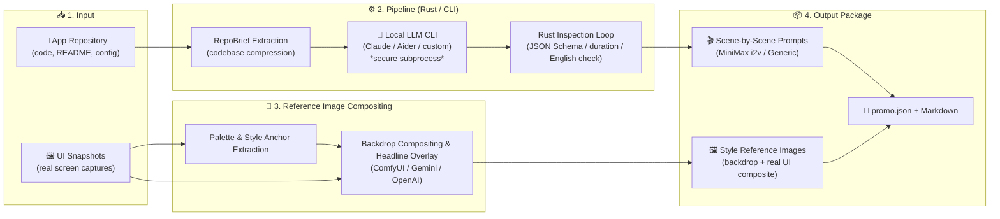

**English** | [日本語](README_jp.md)

<div align="center">

# 🎬 Outcasts AppPromoVideo

**A desktop tool that takes an existing app repository and UI snapshots and outputs scene-by-scene prompts and reference images ready to paste into video-generation AIs**

[-orange?style=flat-square&logo=rust)](https://www.rust-lang.org/)
[](https://v2.tauri.app/)
[](https://vuejs.org/)
[](https://v2.tauri.app/)
[](LICENSE)

<br />

<video src="https://github.com/user-attachments/assets/ca12f1cf-b9c0-427d-b46e-c2c8fc6fda31" controls="controls" muted="muted" width="100%"></video>

<br />

> **"Ready-to-paste output."**  
> Not clever copywriting — prompts with the right granularity to paste directly into video-generation UIs, and reference images that stay faithful to your snapshots.  
> *It doesn't create the video itself. It crafts the ultimate "brief" for video-generation AIs.*

</div>

---

## 💡 Why AppPromoVideo?

Trying to create an app promo video with video-generation AIs (MiniMax / Runway / Luma, etc.) quickly hits two walls:

1. **Prompt trial-and-error**: Scene breakdown, camera work, duration allocation, and English prompt assembly take enormous effort.
2. **Drift from the real app**: Generic prompts produce UI, tone, and style that look nothing like the actual app.

**AppPromoVideo** solves both at once — just feed it a repository and UI screenshots.

### Three Core Values

* 🎯 **Ready-to-Paste Output**  
  English motion prompts for MiniMax image-to-video, plus full prompts for generic text-to-video. One-click copy to clipboard and paste straight into any video-generation UI.
* 🎨 **Visually Faithful Reference Images**  
  Extracts a color palette and style anchors from UI snapshots. Generates reference images faithful to the real app by compositing AI-generated backdrops with actual screenshots (rounded corners, drop shadows, headline overlays).
* 🛡️ **Secure Local CLI Execution (Secure & Sandboxed)**  
  Instead of calling LLM HTTP APIs directly, launches a locally authenticated CLI (`claude -p` / Aider / custom, etc.) as a safe subprocess. Thorough sandboxing with Windows Job Objects / Unix pgids for reliable termination of descendant processes and read-only filesystem boundaries.

---

## 🔄 Pipeline Overview

> *The LLM writes, Rust inspects, the CLI scans, the model paints the stage, and Rust composites the screen.*



---

## ✨ Key Features

* **Automatic scene-by-scene prompt generation**: Supports durations of 15s / 30s / 60s and aspect ratios of 16:9 / 9:16 / 1:1.
* **One-click clipboard copy**: Copy only the motion prompt for MiniMax (image-to-video), or the full prompt with ratio/duration on separate lines for generic text-to-video.
* **Multi-provider image generation**: ComfyUI (local, no API key required), Gemini, and OpenAI (`images/edits`) supported.
* **Headline / caption overlay**: Layout catchphrases onto images with configurable font, position, and style.
* **History (Runs)**: Past generations are safely isolated under `runs/<run_id>/` and recallable at any time.
* **GUI & CLI**: Ships with both a Tauri 2 desktop app and a `promo` CLI for terminal / scripted automation.

---

## 🚀 Quick Start

### Requirements

* **OS**: Windows / macOS / Linux (cross-platform)
* **Rust**: `2024` edition / rust-version `1.85` or later
* **Node.js**: Stable (LTS recommended; for frontend build)
* **Local LLM CLI**: An authenticated CLI on PATH — `claude` (Claude Code CLI, default), `agy`, `aider`, or a custom command. `agy` cannot disable write tools on its side, so the app can only detect and stop disallowed tools after the fact; use `claude` for repositories you don't trust

### Build & Launch (GUI)

```bash
# 1. Clone the repository
git clone https://github.com/betyourluck/AppPromoVideo.git
cd AppPromoVideo

# 2. Run Rust workspace tests
cargo test --workspace

# 3. Launch GUI (Tauri 2 + Vue 3)
cd app
npm install
npm run tauri dev
```

> [!TIP]
> If you hit a build error caused by `sccache`, run with `RUSTC_WRAPPER=` unset.

```bash
# Frontend unit tests / type check / build
cd app
npx vitest run
npm run build

# Backend unit tests / lint
cd app/src-tauri
cargo test
cargo clippy
```

---

## 🖥️ How to Use the GUI

```text
+-----------------------------------------------------------------------------------------+
| [TopBar] AppPromoVideo                              [Runs] [Settings] [Theme] [Min/Max/X] |
+-----------------------+---------------------------------+-------------------------------+
| 📁 InputPane           | 🎬 ScenePanel                   | 📜 LogPanel                   |
|                       |                                 |                               |
| - Repository selection| - App summary & differentiators | - Real-time progress logs     |
| - UI snapshots        | - Scene list (Prompt & Image)   | - CLI subprocess tracing      |
| - Duration / ratio /  | - Copy (MiniMax / All)          | - Errors & warnings           |
|   language            | - Reference image trigger       |                               |
| [ ▶ Analyze → Build   | [ 💾 Export to folder ]         |                               |
|     Scenes ]          |                                 |                               |
+-----------------------+---------------------------------+-------------------------------+
```

1. **Launch & connectivity check**: On startup the app automatically checks LLM CLI connectivity/authentication (`check_cli`).
2. **Configure inputs (`InputPane`)**:
   - Specify the target repository path.
   - Add UI screenshots (file picker / drag & drop / clipboard paste).
   - Set the video concept, duration (15 / 30 / 60s), aspect ratio (16:9 / 9:16 / 1:1), and copy language.
3. **Analyze & build scenes**:
   - Click **"Analyze → Build Scenes"** to run `run_pipeline`.
   - The right pane (`LogPanel`) streams subprocess progress in real time.
4. **Review & copy prompts (`ScenePanel`)**:
   - View the app summary, differentiators, and per-scene prompts.
   - Copy individual scenes or all at once, formatted for the copy target (MiniMax / generic).
5. **Generate reference images**:
   - Optionally run **"Generate Reference Images"** to create visual reference images (OpenAI / Gemini / ComfyUI).
6. **Export artifacts**:
   - Use "Open Folder" or "Export to Folder" to save the complete output package.

---

## ⌨️ CLI (`promo`) Usage

A `promo` CLI binary is included for terminal and scripted automation.

```bash
# Run analyze → scene composition → image generation → package export in one go
cargo run -p pipeline --bin promo -- run <path/to/repo> --concept "An innovative task management tool"

# Output only the RepoBrief (compressed summary manifest) for a repository (no LLM)
cargo run -p pipeline --bin promo -- brief <path/to/repo>

# Generate additional reference / scene images for an existing promo.json
cargo run -p pipeline --bin promo -- images promo_out/promo.json --images comfy

# Test headline overlay (visual check, no LLM)
cargo run -p pipeline --bin promo -- caption in.png "Noto Sans JP" 0 "Sync instantly." out.png

# Test backdrop + screenshot compositing (visual check, no LLM)
cargo run -p pipeline --bin promo -- compose backdrop.png screenshot.png out.png 16:9

# List available fonts
cargo run -p pipeline --bin promo -- fonts
```

---

## 📦 Output Package Layout

Each run is fully isolated under a unique `runs/<run_id>/` directory.

```text
<export_dir>/
└── <AppName>_Promo_Package/
    └── runs/
        └── 20260914-071122/              # run_id = YYYYMMDD-HHMMSS (local time); -2, -3 … on collision
            ├── promo.json                # Summary, scene plan, prompts, and your edits — the run can be restored from this alone
            ├── scenes.md                 # Shot list and per-scene prompts (always rewritten together with promo.json)
            ├── scene_01_ref_01.png       # Reference image with the headline burned in — pass this to MiniMax
            ├── base/
            │   └── scene_01_ref_01.png   # Source material: backdrop (product cut) / picture (mood cut); re-burning starts here, no API call
            └── snapshots/
                └── snapshot_01.png       # Copies of the input UI snapshots
```

`scene_NN_ref_MM.png` and `base/` appear only after you generate reference images.

---

## 🏗️ Workspace Architecture

Built as a Rust workspace (4 crates) plus a Tauri 2 desktop application.

| Crate / Directory | Role | Responsibilities |
|---|---|---|
| [`crates/promo_core`](crates/promo_core) | **Pure-function core domain** | No process/HTTP side effects. Type definitions for `RepoBrief` / `ScenePlan`, mechanical JSON Schema generation, rescue of malformed LLM JSON (`fenced_json`), prompt text generation. |
| [`crates/cli_runner`](crates/cli_runner) | **Secure CLI subprocess execution** | Launches a local LLM CLI as a subprocess. Safe argv construction (stdin/temp-file transport), scrubbing of auth env vars, reliable forced termination of descendants via Windows Job Objects / Unix pgids. |
| [`crates/image_gen`](crates/image_gen) | **Image generation & compositing engine** | Reference image generation via ComfyUI (polling), Gemini, and OpenAI. Dominant-color extraction from UI snapshots (Palette), rounded-corner / drop-shadow compositing, headline caption overlay. |
| [`crates/pipeline`](crates/pipeline) | **Orchestration & CLI** | I/O harness wiring the crates together. File collection, LLM interaction, Rust-side inspection loop (auto-regeneration on violation), package export, and the `promo` CLI binary itself. |
| [`app/`](app/) | **Desktop GUI** | Tauri 2 + Vue 3 + TypeScript. Calls the backend via `#[tauri::command]` and receives progress in real time via Tauri Events. Settings and history UI. |

---

## 🎨 Image Generation Provider Support

| Provider | Integration | API Key | Status |
|---|---|:---:|---|
| **Gemini** | `models/{model}:generateContent` | Required | ✅ Verified end-to-end on real hardware |
| **OpenAI** | `images/generations` (no references) / `images/edits` (with references) | Required | ⚠️ Implemented; not yet verified end-to-end on real hardware |
| **ComfyUI** | Local HTTP polling (upload → `/prompt` → `/history` → `/view`) | **Not required** | ⚠️ Implemented; not yet verified end-to-end on real hardware |

---

## ⚙️ Configuration & Security

* **Separated config storage**:
  - UI settings and CLI options: `%APPDATA%/jp.outcasts.apppromovideo/settings.json`
  - Image-generation API keys: `.env` in the same directory
* **Credential leak prevention**:
  - Raw API keys are never exposed to the WebView (frontend); they are held and used only on the backend (Rust side) — the frontend only receives a boolean indicating whether a key is set.
* **LLM CLI authentication troubleshooting**:
  - If the GUI repeatedly returns 401 (`authentication_failed`) for the LLM CLI on startup, enable **"Use OAuth login"** in Settings (suppresses propagation of `ANTHROPIC_API_KEY` to the child process).
* **Known constraints & pitfalls**:
  - Additional gotchas and workarounds are collected in [`failures.md`](failures.md) (PowerShell redirect conflicts, `gen` becoming a reserved keyword in Rust 2024, etc.).

---

## 📚 Documentation

Detailed design principles and operational rules are maintained in the following ledgers:

* 📘 [`specs/01_promo_pipeline.md`](specs/01_promo_pipeline.md) — Spec, phase plan, and grounding limits
* 📐 [`data_contract.yaml`](data_contract.yaml) — Types, limits, enums, and invariants (canonical source)
* 🧭 [`CLAUDE.md`](CLAUDE.md) — North star, architecture, and development rules
* ⚠️ [`failures.md`](failures.md) — Known pitfalls, workarounds, and incident ledger
* 📜 [`history.md`](history.md) — Implementation log and history

---

## 📄 License

Released under the [MIT License](LICENSE).
