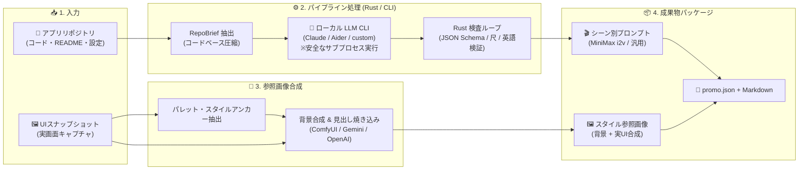

[English](README.md) | **日本語** 

<div align="center">

# 🎬 Outcasts AppPromoVideo

**既存アプリのリポジトリと UI スナップショットから、動画生成 AI にそのまま貼れる「シーン別プロンプト」と「参照画像」を出力するデスクトップツール**

[-orange?style=flat-square&logo=rust)](https://www.rust-lang.org/)
[](https://v2.tauri.app/)
[](https://vuejs.org/)
[](https://v2.tauri.app/)
[](LICENSE)

<br />

<video src="https://github.com/user-attachments/assets/ca12f1cf-b9c0-427d-b46e-c2c8fc6fda31" controls="controls" muted="muted" width="100%"></video>

<br />

> **「貼れば動く出力」。**  
> 訴求文の巧さではなく、動画生成 UI にそのまま貼れる粒度と、スナップショットに寄った参照画像の一貫性が売り。  
> *動画そのものは作らない。動画生成 AI への最高の「指示書」を仕立てる。*

</div>

---

## 💡 なぜ AppPromoVideo なのか？

動画生成 AI（MiniMax / Runway / Luma 等）でアプリのプロモーション動画を作ろうとすると、2つの壁に突き当たります：

1. **プロンプトの試行錯誤**: シーン割り・カメラワーク・尺配分・英語プロンプトの組み立てに膨大な工数がかかる。
2. **実アプリとの乖離**: 汎用的なプロンプトでは、動画に出てくる UI やトーン＆マナーが実物アプリからかけ離れてしまう。

**AppPromoVideo** は、リポジトリと UI スクリーンショットを投入するだけで、この問題を一気に解決します。

### 3つのコアバリュー

* 🎯 **貼れば動く出力 (Ready-to-Paste)**  
  MiniMax の画像→動画 (i2v) 向けの動きの短文と、汎用 text-to-video 向けの全文を英語で出力。ワンクリックでクリップボードにコピーして即座に動画生成 UI へ投入可能。
* 🎨 **アプリに寄せる参照画像 (Visual Consistency)**  
  UI スナップショットからカラーパレットとスタイルアンカーを抽出。背景生成＋実スクショ合成（角丸・落ち影・見出し焼き込み）により、アプリの実画面に忠実な参照画像を生成。
* 🛡️ **安全なローカル CLI 実行 (Secure & Sandboxed)**  
  LLM の HTTP API を直接叩くのではなく、ローカル端末に認証済みの CLI（`claude -p` / Aider / custom 等）を安全なサブプロセスとして起動。Windows Job Object / Unix pgid による子孫プロセスの確実な停止と読み取り専用のサンドボックス設計を徹底。

---

## 🔄 パイプライン概要

> *LLM は書き、Rust は検め、CLI が走査し、モデルは舞台を描き、Rust が画面を貼る。*



---

## ✨ 主な機能

* **シーン別プロンプト自動生成**: 15秒 / 30秒 / 60秒 の尺、16:9 / 9:16 / 1:1 のアスペクト比に対応。
* **ワンクリック・クリップボードコピー**: MiniMax 向け（画像→動画に渡す動きの短文だけ）や汎用 text-to-video 向け（全文 + 比率・尺を別行）へ即座にコピー。
* **マルチプロバイダ画像生成**: ComfyUI（ローカル・APIキー不要）、Gemini、OpenAI (`images/edits`) に対応。
* **見出し・キャプション焼き込み**: 任意フォント・配置・スタイルでキャッチコピーを画像にレイアウト。
* **履歴管理 (Runs)**: 過去の生成履歴を `runs/<run_id>/` に安全に分離・保存。いつでも呼び出し可能。
* **GUI ＆ CLI 両対応**: Tauri 2 製のデスクトップアプリと、ターミナルから自動実行できる `promo` CLI を同梱。

---

## 🚀 クイックスタート

### 動作要件

* **OS**: Windows / macOS / Linux（クロスプラットフォーム対応）
* **Rust**: `2024` edition / rust-version `1.85` 以上
* **Node.js**: 安定版（LTS 推奨。フロントエンドビルド用）
* **ローカル LLM CLI**: PATH 上に通っており、認証済みの CLI — `claude` (Claude Code CLI、既定) / `agy` / `aider` / カスタムのコマンド。`agy` は CLI 側で書き込み系のツールを止められず、アプリは許可外のツールを見つけて止めるだけ (予防ではない) なので、信頼できないリポジトリには `claude` を使ってください

### ビルド & 起動 (GUI)

```bash
# 1. リポジトリをクローン
git clone https://github.com/betyourluck/AppPromoVideo.git
cd AppPromoVideo

# 2. Rust ワークスペースのテスト
cargo test --workspace

# 3. GUI (Tauri 2 + Vue 3) の起動
cd app
npm install
npm run tauri dev
```

> [!TIP]
> `sccache` に起因するビルドエラーが発生した場合は、環境変数 `RUSTC_WRAPPER=` を指定して実行してください。

```bash
# フロントエンド単体テスト・型検査・ビルド
cd app
npx vitest run
npm run build

# バックエンド単体テスト・Lint
cd app/src-tauri
cargo test
cargo clippy
```

---

## 🖥️ GUI の使い方

```text
+-----------------------------------------------------------------------------------------+
| [TopBar] AppPromoVideo                              [Runs] [Settings] [Theme] [Min/Max/X] |
+-----------------------+---------------------------------+-------------------------------+
| 📁 InputPane           | 🎬 ScenePanel                   | 📜 LogPanel                   |
|                       |                                 |                               |
| - リポジトリ選択      | - アプリ要約 & 差別化ポイント   | - リアルタイム進捗ログ         |
| - UIスナップショット  | - シーン一覧 (Prompt & Image)   | - CLIサブプロセス通信追跡     |
| - 尺 / 比率 / 言語    | - コピー (MiniMax / All)        | - エラー & 警告表示           |
|                       | - 参照画像生成トリガー          |                               |
| [ ▶ 解析 → シーン構成 ] | [ 💾 別フォルダへ書き出し ]     |                               |
+-----------------------+---------------------------------+-------------------------------+
```

1. **起動 & 疎通確認**: アプリ起動時に LLM CLI（`check_cli`）の接続・認証チェックが自動実行されます。
2. **入力設定 (`InputPane`)**:
   - 対象リポジトリのパスを指定します。
   - アプリの UI スクリーンショットを追加します（ファイル選択 / ドラッグ＆ドロップ / クリップボード貼り付け）。
   - 動画イメージ（コンセプト）、尺（15 / 30 / 60秒）、アスペクト比（16:9 / 9:16 / 1:1）、コピー言語を設定します。
3. **解析＆シーン構成**:
   - 「**解析 → シーン構成**」をクリックすると `run_pipeline` が走ります。
   - 右ペイン（`LogPanel`）にサブプロセスのストリーミング進捗がリアルタイム表示されます。
4. **プロンプト確認 & コピー (`ScenePanel`)**:
   - アプリ要約、差別化ポイント、各シーンのプロンプトが表示されます。
   - 各シーンまたは全シーン一括で、コピー先（MiniMax / 汎用）に合わせた形式でクリップボードにコピーできます。
5. **参照画像の生成**:
   - 必要に応じて「**参照画像を生成**」を実行し、ビジュアル参照用画像を生成します（OpenAI / Gemini / ComfyUI）。
6. **成果物のエクスポート**:
   - 「フォルダを開く」または「別フォルダへ書き出し」で、成果物パッケージ一式を保存します。

---

## ⌨️ CLI (`promo`) の使い方

ターミナルやスクリプトから自動実行するための `promo` CLI バイナリを提供しています。

```bash
# 解析 → シーン構成 → 画像生成 → パッケージ出力を一括実行
cargo run -p pipeline --bin promo -- run <path/to/repo> --concept "革新的なタスク管理ツール"

# リポジトリの RepoBrief (圧縮要約マニフェスト) のみを出力 (LLM 不使用)
cargo run -p pipeline --bin promo -- brief <path/to/repo>

# 既存の promo.json に対して参照画像・シーン画像を追加生成
cargo run -p pipeline --bin promo -- images promo_out/promo.json --images comfy

# 見出し焼き込みのテスト (目視確認用、LLM 不使用)
cargo run -p pipeline --bin promo -- caption in.png "Noto Sans JP" 0 "瞬時に同期。" out.png

# 背景とスクリーンショットの合成テスト (目視確認用、LLM 不使用)
cargo run -p pipeline --bin promo -- compose backdrop.png screenshot.png out.png 16:9

# 利用可能なフォント一覧を表示
cargo run -p pipeline --bin promo -- fonts
```

---

## 📦 成果物パッケージ構成

生成された成果物は、実行ごとにユニークな `runs/<run_id>/` 配下に完全分離して出力されます。

```text
<出力先フォルダ>/
└── <アプリ名>_Promo_Package/
    └── runs/
        └── 20260914-071122/              # run_id = YYYYMMDD-HHMMSS (ローカル時刻)。同じ秒なら -2, -3 …
            ├── promo.json                # 要約・シーン構成・プロンプト・手で直した見出しやはめ込み。この 1 つで run を復元できる
            ├── scenes.md                 # シーンの構成表と各シーンのプロンプト (promo.json と必ず一緒に書き直される)
            ├── scene_01_ref_01.png       # 見出しを焼いた参照画像 — MiniMax に渡すのはこれ
            ├── base/
            │   └── scene_01_ref_01.png   # 素材: product は背景 / mood は絵。焼き直しはここから (API は呼ばない)
            └── snapshots/
                └── snapshot_01.png       # 入力した UI スナップショットの写し
```

`scene_NN_ref_MM.png` と `base/` は、参照画像を生成したときだけできます。

---

## 🏗️ ワークスペース構成 (Architecture)

Rust ワークスペース（4 crates）と Tauri 2 デスクトップアプリケーションで構成されています。

| Crate / Directory | 役割 | 主な責務・特徴 |
|---|---|---|
| [`crates/promo_core`](crates/promo_core) | **純関数の中核ドメイン** | プロセス/HTTP通信を持たない純粋関数。`RepoBrief`（リポジトリ圧縮）、`ScenePlan` の型定義と JSON Schema 機械生成、LLM 不正 JSON の救済 (`fenced_json`)、プロンプトテキスト生成。 |
| [`crates/cli_runner`](crates/cli_runner) | **安全な CLI サブプロセス実行** | ローカル LLM CLI をサブプロセスとして起動。argv 安全構築（stdin/一時ファイル運搬）、認証環境変数のスクラブ、Windows Job Object / Unix pgid による子孫プロセスの確実な強制終了。 |
| [`crates/image_gen`](crates/image_gen) | **画像生成 & 合成エンジン** | ComfyUI（ポーリング）、Gemini、OpenAI による参照画像生成。UI スナップショットからの支配色抽出（Palette）、角丸・落ち影合成、フォント見出し焼き込み（Caption）。 |
| [`crates/pipeline`](crates/pipeline) | **オーケストレーション & CLI** | 各 crate を結線する I/O ハーネス。ファイル収集、LLM 対話、Rust 側検査ループ（違反時の自動再生成）、パッケージ書き出し、および `promo` CLI バイナリの実装。 |
| [`app/`](app/) | **デスクトップ GUI** | Tauri 2 + Vue 3 + TypeScript。`#[tauri::command]` 経由で backend を呼び出し、進捗は Tauri Event でリアルタイム受信。設定・履歴管理 UI。 |

---

## 🎨 画像生成プロバイダ対応状況

| プロバイダ | 連携方式 | API キー | 検証状況 |
|---|---|:---:|---|
| **Gemini** | `models/{model}:generateContent` | 要 | ✅ 実機で通しを検証済み |
| **OpenAI** | `images/generations` (参照なし) / `images/edits` (参照あり) | 要 | ⚠️ 実装済み。実機での通しは未検証 |
| **ComfyUI** | ローカル HTTP ポーリング (アップロード → `/prompt` → `/history` → `/view`) | **不要** | ⚠️ 実装済み。実機での通しは未検証 |

---

## ⚙️ 設定とセキュリティ

* **設定ファイルの分離保存**:
  - UI 表示設定や CLI オプション: `%APPDATA%/jp.outcasts.apppromovideo/settings.json`
  - 画像生成 API キー: 同ディレクトリ内の `.env`
* **認証情報の漏洩防止**:
  - API キーの平文は WebView（フロントエンド）に一切露出せず、バックエンド（Rust 側）でのみ安全に保持・使用されます（フロントエンドにはキー有無の真偽値のみ伝達）。
* **LLM CLI 認証のトラブルシューティング**:
  - GUI 起動時に LLM CLI が 401 (`authentication_failed`) を繰り返す場合は、設定画面で「**OAuth ログインを使う**」を有効化してください（子プロセスへの `ANTHROPIC_API_KEY` の伝播を抑制します）。
* **既知の制約・実装の罠**:
  - その他の実装上の罠・回避策は [`failures.md`](failures.md) に集約しています（PowerShell のリダイレクト競合、Rust 2024 での `gen` 予約語化など）。

---

## 📚 ドキュメント体系

プロジェクトの詳細な設計思想や運用ルールは、以下の台帳で厳格に管理されています：

* 📘 [`specs/01_promo_pipeline.md`](specs/01_promo_pipeline.md) — 仕様書・フェーズ計画・接地限界
* 📐 [`data_contract.yaml`](data_contract.yaml) — 型・上限・enum・不変条件（正本）
* 🧭 [`CLAUDE.md`](CLAUDE.md) — 北極星・アーキテクチャ・開発掟
* ⚠️ [`failures.md`](failures.md) — 既知の罠・回避策・障害台帳
* 📜 [`history.md`](history.md) — 実装作業ログ・経緯

---

## 📄 ライセンス

本プロジェクトは [MIT License](LICENSE) のもとで公開されています。
